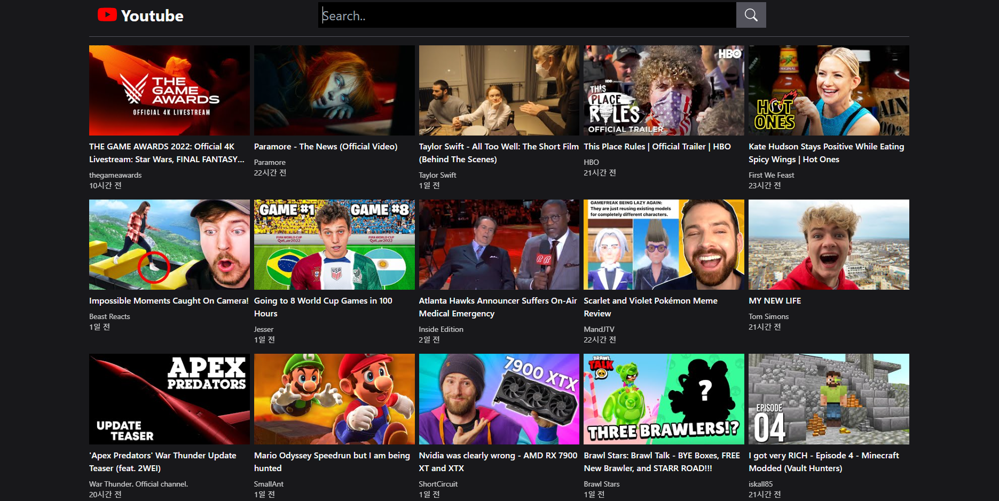
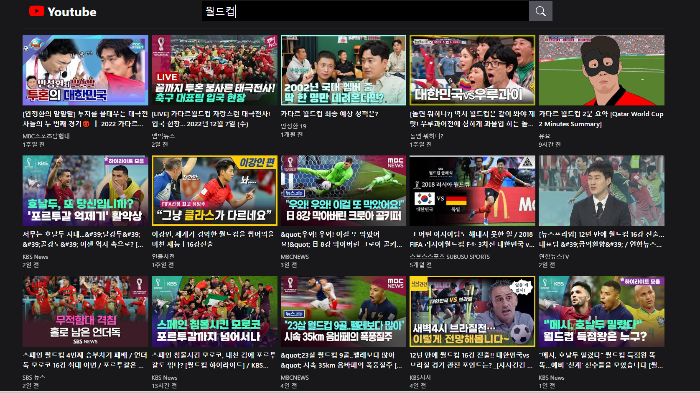
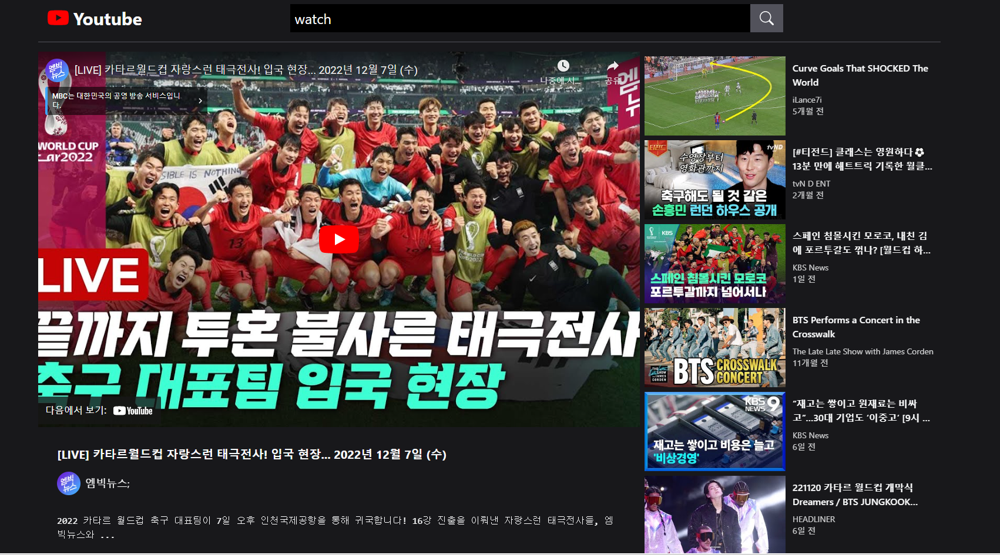

# Youtube-Project

React와 유튜브 API를 사용하여 유튜브의 기능을 만들어 본 웹사이트이다.

## 실행예시

- 홈화면 - 홈 화면 실행 시 현재 핫 비디오를 보여준다.
  

- 검색화면 - 검색한 키워드와 관련된 비디오를 보여준다.
  

- 상세 페이지화면 - 유튜브 영상 및 영상에 관한 정보, 관련 동영상의 정보를 보여준다.
  

## 기술 스택

 
  
  

  
  

## 참고자료 및 API

**위 프로젝트는 드림코딩의 강의를 활용하여 제작하였습니다.**

- [드림코딩](https://academy.dream-coding.com/courses/react)
- [유튜브 API](https://developers.google.com/youtube/v3/getting-started?hl=ko)
- [Iframe Player API](https://developers.google.com/youtube/iframe_api_reference)
